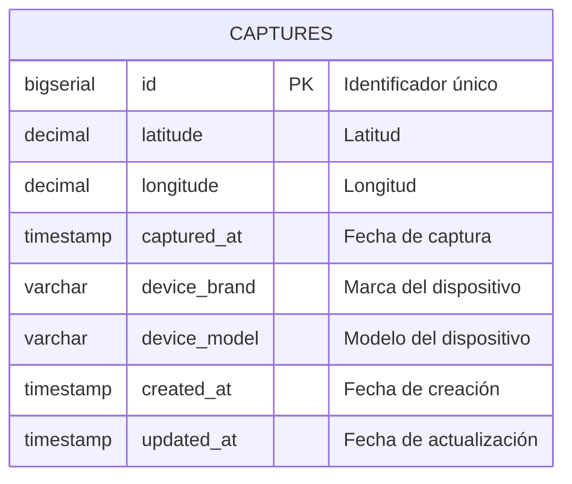

# Diagrama de Base de Datos - GeoAPP

## Diagrama ER (Entity Relationship)



## Estructura de la Tabla `captures`

| Columna | Tipo | Restricciones | Descripción |
|---------|------|---------------|-------------|
| `id` | BIGSERIAL | PRIMARY KEY | Identificador único autoincremental |
| `latitude` | DECIMAL | NOT NULL | Latitud de la ubicación |
| `longitude` | DECIMAL | NOT NULL | Longitud de la ubicación |
| `captured_at` | TIMESTAMP WITH TIME ZONE | NULL | Fecha y hora cuando se capturó la ubicación |
| `device_brand` | VARCHAR(255) | NULL | Marca del dispositivo (ej: Samsung, Apple) |
| `device_model` | VARCHAR(255) | NULL | Modelo del dispositivo (ej: Galaxy S21, iPhone 13) |
| `created_at` | TIMESTAMP WITH TIME ZONE | NOT NULL, DEFAULT NOW() | Fecha y hora de creación del registro |
| `updated_at` | TIMESTAMP WITH TIME ZONE | NOT NULL, DEFAULT NOW() | Fecha y hora de última actualización |

## Índices

- **PRIMARY KEY**: `id`
- **INDEX**: `index_captures_on_created_at` en `created_at`
- **INDEX**: `index_captures_on_captured_at` en `captured_at`
- **INDEX**: `index_captures_on_coordinates` en `(latitude, longitude)`

## Ejemplo de Datos

```json
{
  "id": 1,
  "latitude": 4.7110,
  "longitude": -74.0721,
  "captured_at": "2025-01-15T10:30:00Z",
  "device_brand": "Samsung",
  "device_model": "Galaxy S21",
  "created_at": "2025-01-15T10:30:00Z",
  "updated_at": "2025-01-15T10:30:00Z"
}
```

## Notas Técnicas

- **Zona Horaria**: Todos los campos timestamp incluyen información de zona horaria
- **Precisión**: Los campos `latitude` y `longitude` usan DECIMAL para máxima precisión
- **Indexación**: Optimizado para consultas por fecha y coordenadas geográficas
- **Automatización**: Campo `updated_at` se actualiza automáticamente con triggers

