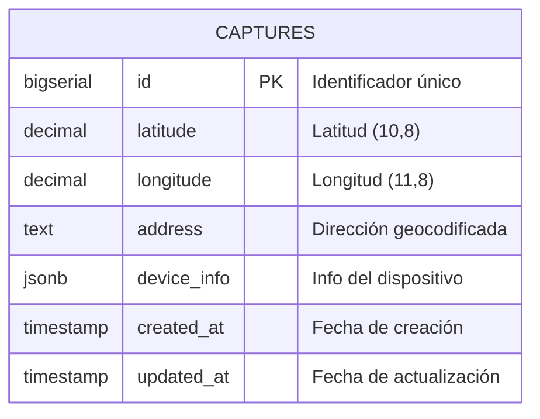

# Diagrama de Base de Datos - GeoAPP

## Diagrama ER (Entity Relationship)

## Estructura de la Tabla `captures`

| Columna | Tipo | Restricciones | Descripción |
|---------|------|---------------|-------------|
| `id` | BIGSERIAL | PRIMARY KEY | Identificador único autoincremental |
| `latitude` | DECIMAL(10,8) | NOT NULL | Latitud de la ubicación |
| `longitude` | DECIMAL(11,8) | NOT NULL | Longitud de la ubicación |
| `address` | TEXT | NULL | Dirección obtenida por geocodificación |
| `device_info` | JSONB | NULL | Información del dispositivo móvil |
| `created_at` | TIMESTAMP | NOT NULL, DEFAULT NOW() | Fecha y hora de creación |
| `updated_at` | TIMESTAMP | NOT NULL, DEFAULT NOW() | Fecha y hora de actualización |

